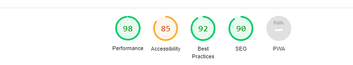

# [**Kindness**](https://kindnesscharity.herokuapp.com/)

**Kindness** is a Charity that allows users to set up monthly donation plans to a charity selected by us each month, users will also have access to our shop.

---

<h2 align=center id="top"><strong>Table of Contents</strong></h2>

- <a href=#UX><h3><strong>User Experience</strong></h3></a>
    - [**User Stories**](#user-stories)
    - [**Design**](#design)
        - [**Colour Scheme**](#colour-scheme)
        - [**Typography**](#typography)
        - [**Frameworks**](#frameworks)
        - [**Icons**](#icons)
        - [**Wireframes**](#wireframes)
            - [**Desktop**](#desktop)
            - [**Tablet**](#tablet)
            - [**Mobile**](#mobile)

- <a href=#features><h3><strong>Features</strong></h3></a>
    - [**Current Features**](#current-features)
        - [**Features on every page**](#features-on-every-page)
        - [**Landing Page**](#landing-page)
        - [**Donation Page**](#donation)
        - [**Shop**](#shop)
        - [**Login/Register**](#login-register)
        - [**Chekout**](#checkout)
    - [**Future Features**](#future-features)

- <a href=#da><h3><strong>Database Architecture</strong></h3></a>  
    - [**Categories**](#categories)
    - [**Products**](#product)
    - [**Membership**](#membership)
    - [**User Membership**](#user-membership)
    - [**Subscription**](#subscription)
    - [**Order**](#order)

- <a href=#TU><h3><strong>Technologies Used</strong></h3></a>
    - [**Front End Technologies**](#front-end-technologies)
    - [**Backend Technologies**](#back-end-technologies)
    - [**Other Tools Used**](#other-tools-used)

-  <a href=#T><h3><strong>Testing</strong></h3></a>
    - [**Code Testing**](#code-testing)
    - [**Validator Testing**](#validator-testing)
    - [**User Story Testing**](#User-Story-Testing)
    - [**Manual Testing**](#manual-testing)
    - [**Lighthouse**](#lighthouse)
    - [**Responsive Testing**](#responsive-testing)
    - [**Bug Report**](#bug-report)

- <a href=#deployment><h3><strong>Deployment</strong></h3></a>
    - [**Local Deployment**](#local-deployment)
    - [**Heroku Deployment**](#heroku-deployment)

- <a href=#credits><h3><strong>Credits</strong></h3></a>
    - [**Code**](#code)
    - [**Media**](#media)
    - [**Content**](#content)

- <a href=#acknowledgements><h3><strong>Acknowledgements</strong></h3></a>

<h2 align=center id="UX"><strong>User Experience</strong></h2>

- #### **User Stories**
    1. **As a user**, I want the website to be fully reponsive. 
    2. **As a user**, I want to be able to login
    3. **As a user**, I want to be able to donate to charity on a monthly basis. 
    4. **As a user**, I want to be able to cancel my monthly donation. 
    5. **As a user**, I want to be able to edit the monthly donation i have set up. 
    6. **As a user**, I want all information to be displayed on the home page. 
    7. **As a user**, I want to be able to be able to view a shop. 
    9. **As a user**, I  want to be able to edit and delete items in my shopping basket.
    10. **As a user**, I get extra information about the product i am about to purchase.

#### **Design**

**Kindness** is a fully resposnive simple website that is split into two sections 

**Donations:**

Users are able to pick a donation plan of 10,20 or 30 euro and will be charged that price on a monthly basis. all the money donated will go to charity 

**Shop:**

Users will also be able to view our shop once they have an account made. They will be able to view all of our products on offer and also make a one off donation.

#### **Colour Scheme**

#### **Typography**
 
 - [**Roboto:**](https://fonts.google.com/specimen/Roboto?query=roboto)
    - The primary font used across this website used in regular and blod font weights.

- [**Dancing Script**](https://fonts.google.com/specimen/Dancing+Script?query=dancing+script)
    - Dancing Script was used for the navbar logo and headings in a font weight of 100.
    - This was picked as its is a cursive font that pairs will with roboto. 

### **Frameworks**

- [Django 3.0](https://docs.djangoproject.com/en/3.0/releases/3.0/) 
    - Django was used to render the back-end Python code with the front-end code. 

- [JQuery](https://code.jquery.com/jquery/)
    - In order to minimalize the amount of Javascript used across the application, I chose to implement a lot of the JS functionality with JQuery.

- [Boostrap](https://getbootstrap.com/)
    - Bootstrap was used to help with styling of each page and also to make each page fully responsive. 
### **Icons**

- [Font Awesome](https://fontawesome.com/)
    - All Icons used we gotten from font awesome.

- #### **Desktop**
    - [**Landing page**](wireframes/desktop/ms4landingdesktop.png)
    - [**Login page**](wireframes/desktop/logindesktop.png)
    - [**Signup page**](wireframes/desktop/signupdesktop.png)
    - [**Shop page**](wireframes/desktop/shopdesktop.png)
    - [**Checkout**](wireframes/desktop/checkoutdesktop.png)
    - [**Subscription-Overview**](wireframes/tablet/overviewdesktop.png)
- #### **Tablet**
    - [**Landing page**](wireframes/tablet/landingtablet.png)
    - [**Login page**](wireframes/tablet/logintablet.png)
    - [**Signup page**](wireframes/tablet/signuptablet.png)
    - [**Shop page**](wireframes/tablet/shoptablet.png)
    - [**Checkout**](wireframes/tablet/checkouttablet.png)
    - [**Donation-Overview**](wireframes/tablet/overviewtablet.png)

- #### **Mobile**
    - [**Landing page**](wireframes/mobile/landingmobile.png)
    - [**Login page**](wireframes/mobile/loginmobile.png)
    - [**Signup page**](wireframes/mobile/signupmobile.png)
    - [**Shop page**](wireframes/mobile/shopmobile.png)
    - [**Checkout**](wireframes/mobile/checkoutmobile.png)
    - [**Donation-Overview**](wireframes/mobile/overviewmobile.png)

<h2 align=center id="features"><strong>Features</strong></h2>

### **Current Features**

#### **Features on every page**

- **Navbar**
    - Kindness have a nav bar on every page that will change depending on weather users are logged in or out also it will have a hamburger menu on smaller screen sizes 
        - [**Logged In**](wireframes/loggedin.png)
        - [**Logged Out**](wireframes/loggedout.png)
        - [**Mobile**](wireframes/smallscreen.png)

### **Landing Page**
The landing page is split into three core components: 

- **Main Landing Section**
    - This section has a simple welcome message and the a small paragraph about kindness
- **How it works Section**
    -this is split in to 3 topics which give a user a general idea on that the website is about 
- **Testimonials Section**
   - this section has a carosel with two ficticous testimonials.

### **Donation**
There are 2 core Donation pages 
#### **Overview**
- **Not Donated**
    - When you have not donated this page will have a heading explaining this and a link to donate.
- **Donated**
    - When you have donated 3 cards will be on this page giving information about , Your details, Billing address and donation plan.
#### **Donation options**
    - This page will display 3 card with the 3 donations choices and a button that will allow you to donate or change donation

### **Shop**
- The Shop page contains a search bar and a link to your cart each shop item will be displayed on a card. This card will contain an image,product name which you can click to  get a better description of the product and finally an add to cart button.
-The shop details is a modal that will appear over the shop page. this modal will display all extra information about the product.

### **Login Register**
- The Log in and register pages a quite similar with images on the left hand side and the respective forms on the right hand side
### **Checkouts**
- There are two checkout pages one for the shop and one for the donations. Each page has the same form that will ask for users personal details and billing information, and the on the shop checkout page below this information there will be a overview of what you have ordered.

#### **Future Features**

1. A monthly news letter that will give users information about the charities we have picked.
2. A way for users to vote on which charity will be recieving that months donations

<h2 align=center id="DA"><strong>Database Architecture</strong></h2>

#### **Categories**
- This model contains information on all the categories that the store sells.

    | Name | Key in db | Validation | Data type |
    --- | --- | --- | --- 
    Category | Category | max_length=150 | CharField 

#### **Products**
- This model is found within the shop app. It holds all the information for the items for sale within the current month's shop. 

    | Name | Key in db | Validation | Data type |
    --- | --- | --- | --- 
    Category | Category | max_length=150 | CharField 
    Product ID | pid | max_length=50 | CharField
    Product Name | name | max_length=150 | CharField
    Product Description | description | max_length=500 | TextField
    Product Price | price | max_digits=6, decimal_places=2| DecimalField
    Product Image URL | image_url | max_length=1024, null=True, blank=True | URLField
    Product Image | image | null=True, blank=True | ImageField

#### **Membership**
- This model is found within the Memberships app. This model contains the relevant information for the three membership choices - free, regular & premium. 

    | Name | Key in db | Validation | Data type |
    --- | --- | --- | --- 
    Membership Type | membership_type | choices=MEMBERSHIP_CHOICES,default='Free',max_length=200, null=False, blank=False  | CharField
    Monthly Cost | price | deafult=15 | IntegerField
    Membership Description | description_one |  | TextField
    Membership Description | description_two |  | TextField
    Membership Description | description_three |  | TextField
    Membership Description | description_four |  | TextField
    Stripe Price ID | stripe_plan_id | max_length=40 | CharField

#### **User Membership**
- This is found in the memberships app.  The User Membership model holds information on each user's membership.  This will default to free if a user does not have a subscription. 

    | Name | Key in db | Validation | Data type |
    --- | --- | --- | --- 
    Logged in User | user | settings.AUTH_USER_MODEL, on_delete=models.CASCADE  | OneToOneField
    Stripe Customer ID | stripe_customer_id | max_length=40 | CharField
    User Full Name | full_name | max_length=200,  null=False | TextField
    User Email Address | email | max_length=254,  null=False | EmailField
    User Phone Number | phone_number | max_length=30,  null=False | CharField
    User Address Line 1 | street_address1 | max_length=80,  null=False | CharField
    User Address Line 2 | street_address1 | max_length=80,  null=False | CharField
    User Town/City | town_or_city | max_length=40,  null=False | CharField
    User County | county | max_length=80,  null=False | CharField
    User Country | country | max_length=80,  null=False | CharField
    User Postcode | postcode | max_length=500,  null=False | CharField

#### **Subscription**
- This model is found in the memberships app.  It holds the information on the subscription if the user has an active subscription and the strip subscription ID. It links to the User Membership. 

    | Name | Key in db | Validation | Data type |
    --- | --- | --- | --- 
    User Membership Type | user_membership | UserMembership, on_delete=models.CASCADE | ForeignKey
    Stripe Subscription ID | stripe_subscription_id | max_length=40 | CharField
    Subscription Active | active | default=False | BooleanField

#### **Orders**
- An instance of the Order model is created before any OrderItems, as the latter relies on the former for a ForeignKey.

    | Name | Key in db | Validation | Data type |
    --- | --- | --- | --- 
    Order Number | user_membership | UserMembership, on_delete=models.CASCADE | ForeignKey
    User Full Name | full_name | max_length=200,  null=False | TextField
    User Email Address | email | max_length=254,  null=False | EmailField
    User Phone Number | phone_number | max_length=30,  null=False | CharField
    User Address Line 1 | street_address1 | max_length=80,  null=False | CharField
    User Address Line 2 | street_address1 | max_length=80,  null=False | CharField
    User Town/City | town_or_city | max_length=40,  null=False | CharField
    User County | county | max_length=80,  null=False | CharField
    User Country | country | max_length=80,  null=False | CharField
    User Postcode | postcode | max_length=500,  null=False | CharField
    Date | postcode | auto_now_add=True | DateTimeField
    Order Total| postcode | max_digits=10,decimal_places=2,null=False,default=0 | DecimalField
    Grand Total | postcode | max_digits=10,decimal_places=2,null=False,default=0 | DecimalField

<h2 align=center id="TU"><strong>Technologies Used</strong></h2>

- ### **Front End Technologies**
    - **HTML**
    - **CSS**
    - [**JQuery**](https://jquery.com/) to reduce javascript code.
    - [**Stripe**](https://stripe.com/) as a payment platfom.
    - [**AWS S3**](http://aws.amazon.com/) to store images held in the database
    - [**Boostrap**](https://getbootstrap.com/) used to make website pages fully responsive 

- ### **Backend Technologies**
    - [**Python**](https://www.python.org/) 
    - [**Django 3.0**](https://docs.djangoproject.com/en/3.0/releases/3.0/) the backend framework
    - [**Heroku**](http://heroku.com/) used to host website
    - [**PostgreSQL**](https://www.postgresql.org/) for heroku database
    - [**SQLite**](https://www.sqlite.org/index.html) for development database

- ### **Other Tools Used** 
    - [**Gitpod**](http://gitpod.io/) the cloud based IDE used for development 
    - [**Github**](https://github.com/) to store and share all project code remotely.
    - [**Balsamiq**](https://balsamiq.com/) used for wireframes 
    - [**AutoPep8**](https://pypi.org/project/autopep8/)  to format code into PEP8 formatting. 
    - [**Boto3**](https://boto3.amazonaws.com/v1/documentation/api/latest/index.html) to enable the creation, configuration, and management of AWS S3.
    - [**Django allauth**](https://django-allauth.readthedocs.io/en/latest/installation.html) to create the signup/login functionality across the site. 
    - [**Django Crispy Forms**](https://django-crispy-forms.readthedocs.io/en/latest/)  to style Django forms.
    - [**Django Storages**](https://django-storages.readthedocs.io/en/latest/) a collection of custom storage backends with Django to work with boto3 and AWS S3.
    - [**Gunicorn**](https://pypi.org/project/gunicorn/)  WSGI HTTP Server for UNIX to aid in the deployment of the Django project to Heroku.
    - [**Pillow**](https://pillow.readthedocs.io/en/stable/) a python imaging library to aid in processing image files to store in the database.
    - [**Psycopg2**](https://pypi.org/project/psycopg2/) as PostgreSQL database adapter for Python.

<h2 align=center id='T'><strong>Testing</strong></h2>

### **Code Testing**
#### **validator testing**
[W3C Markup Validation](https://validator.w3.org/)

W3C Markup Validation was used to validate both the HTMl and CSS for this application.
- No errors were noted in the CSS 
- No errors were noted in the HTML
- 1 Warning was given.

This warning was because of my h1 elements on the ladning page as two of the contained fontawesome icons with no text. The Warning was for having an empty h1.

[JSHint](https://jshint.com/)

 **Metrics**

- When running the `stripe_elements.js` the JSHint validator these metrics were returned :
    - There are 5 functions in this file.
    - Function with the largest signature take 1 arguments, while the median is 1.
    - Largest function has 10 statements in it, while the median is 5.

- When running the `subscription.js` the JSHint validator these metrics were returned :
    - There are 4 functions in this file.
    - Function with the largest signature take 1 arguments, while the median is 1.
    - Largest function has 8 statements in it, while the median is 4.
    - The most complex function has a cyclomatic complexity value of 2 while the median is 1.5.
    - Two undefined variables $ and  Stripe
    - One unused variable  clientSecret

- When running the `subscription.js` the JSHint validator these metrics were returned :
    - There is only one function in this file.
    - It takes no arguments.
    - This function contains 4 statements.
    - Cyclomatic complexity number for this function is 1.
    - One undefined variable $ 

<h2 align=center id="top"></h2>

[Python PEP8](https://pypi.org/project/autopep8/)
- The autopep8 extension was installed in the workspace. 
    - autopep8 was used on all python3 pages

### **User Story Testing**

1. **As a user**, I want the website to be fully reponsive. 
    - Each page on Kindness is fully responsive
2. **As a user**, I want to be able to login
    - You are able to log in to the kindness website
3. **As a user**, I want to be able to donate to charity on a monthly basis. 
    - The donations page allows users to donate on a monthly basis
4. **As a user**, I want to be able to cancel my monthly donation. 
    - The Donation page allows users to cancel there donation
5. **As a user**, I want to be able to edit the monthly donation i have set up. 
    -  The Donation page allows users to edit there donation
6. **As a user**, I want all information to be displayed on the home page. 
    - The landing pages has all you need to know about kindess 
7. **As a user**, I want to be able to be able to view a shop. 
    - You can access the shop once you log in.
9. **As a user**, I  want to be able to edit and delete items in my shopping basket.
    - You can add and remove items from your shopping basket.
10. **As a user**, I get extra information about the product i am about to purchase.
    - You can view more information about each product on the shop page by clicking the product name

### **Manual Testing**

manual testing was completed to make sure each page was fully responsive.

#### **Lighthouse**

A desktop Lighthouse report was completed on the kindness website
The results were as follows:
<h2 align=center id="top"></h2>

A mobile Lighthouse report was completed on the kindess website
The results were as follows:
<h2 align=center id="top"></h2>

### **Desktop Testing**
-
    | Page | Responsive| Notes| 
    --- | --- | ---
    Home | Y | Fully Responsive.
    Myworkouts | Y | Fully Responsive.  
    AllWorkouts | Y | Fully Responsive.
    profile | Y | Fully Responsive.

### **Tablet Testing**
-
   | Page | Responsive| Notes| 
    --- | --- | ---
    Landing | Y | Fully Responsive. No horizontal scrollbar. 
    Donate Plans | Y | Fully Responsive.  No horizontal scrollbar. 
    Donate Overview | Y | Fully Responsive.
    Login | Y | Fully Responsive.  No horizontal scrollbar. 
    Sign-Up | Y | Fully Responsive.  No horizontal scrollbar. 
    Shop | Y | Three items per each row 
    Shop Item | Y |  modal pops up with details and is a appropriate size
    Cart | Y | Fully Responsive.
    Checkout | Y | forms stack on top of eachother nicely. 
    Checkout Success | Y | Fully Responsive.

### **Mobile Testing**
-
  | Page | Responsive| Notes| 
    --- | --- | ---
    Landing | Y | Fully Responsive. how it works sections icons stack on top of eachother. 
    Donate Plans | Y | Fully Responsive.  No horizontal scrollbar. 
    Donate Overview | Y | Fully Responsive.
    Login | Y | Forms get smaller 
    Sign-Up | Y | Forms get smaller 
    Shop | Y | One items per each row 
    Shop Item | Y |  modal pops up with details and is a appropriate size
    Cart | Y | Fully Responsive.
    Checkout | Y | forms stack on top of eachother nicely. 
    Checkout Success | Y | Fully Responsive.

<h2 align=center id="deployment"><strong>Deployment</strong></h2>

### **Local Deployment**

br

1) Having your own IDE such as VS Code or Pycharm.  You will also need to ensure you have PIP, Python3 and GIT
installed. You will also need Stripe for the checkout functionality of this website

2) Then you will need to save a copy of this repository to your computer. 

3) Then in the CLI, enter the following command:

        git clone https://github.com/paullally/kindness

4) Open your IDE, unzip the folder downloaded, and use the `cd` command in the terminal to navigate to the root directory for the project. 

5) Install the requirements.txt file

6) Create an env.py file 
    - In here, you need to have the following env variables: 
        - **os.environ["SECRET_KEY"]** = This key is your Django secret key, that generates when you install Django. 
        - **os.environ["STRIPE_PUBLIC_KEY"]** = his key is obtained when you set up stripe.
        - **os.environ["STRIPE_SECRET_KEY"]** = his key is obtained when you set up stripe.
        - **os.environ["EMAIL_HOST_USER"]** = This is your email address
        - **os.environ["EMAIL_HOST_PASS"]** = Your email password generated from apps.

7) Migrate your models using :

        python manage.py migrate

8) You will need to create a superuser to access the admin panel using 

        python manage.py createsuperuser

9) Navigate to the admin panel & create the Memberships in order to get the site to function correctly.

10) To launch the project use:

        python3 manage.py runserver

br

### **Heroku Deployment**

br

1) Creating a requirements.txt file, filled with all installed modules.  This can be done by typing the following into the terminal:

        pip freeze  requirements.txt

2) Create a Procfile and add the following code to it: 

        web: gunicorn kindness.wsgi:application

4) Create a project on Heroku. 

5) From the Heroku dashboard of your newly created application, click on "Deploy"  "Deployment method" and select GitHub

6) Confirm the linking of the Heroku app to the correct GitHub repository.

7) Head over to the settings page & click on reveal config vars - You need to set the following config variables: 
 
    AWS_ACCESS_KEY_ID : secret key" 
    AWS_SECRET_ACCESS_KEY : secret key 
    AWS_STORAGE_BUCKET_NAME : AWS S3 bucket name 
    DATABASE_URL : your postgres database url
    EMAIL_HOST_PASS : your email address password
    EMAIL_HOST_USER : your email address 
    SECRET_KEY : django secret key 
    STRIPE_PUBLIC_KEY : stripe public key
    STRIPE_SECRET_KEY : stripe secret key 
    USE_AWS : True 

8) From the terminal in your IDE - 
    - Migrate the database models
    - Create your superuser account in your new database

9) In your heroku dashboard, click "Deploy". Scroll down to "Manual Deploy", select the master branch then click "Deploy Branch".
10) View the app
12) Navigate to the admin panel & create the Memberships in order to get the site to function correctly.

