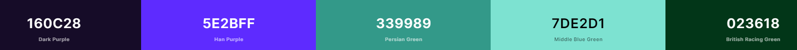

# [**Kindness**](https://kindnesscharity.herokuapp.com/)

**Kindness** is a Charity that allows users to set up monthly donation plans to a charity selected by us each month, users will also have access to our shop.

---

<h2 align=center id="top"><strong>Table of Contents</strong></h2>

- <a href=#UX><h3><strong>User Experience</strong></h3></a>
    - [**User Stories**](#user-stories)
    - [**Design**](#design)
        - [**Colour Scheme**](#colour-scheme)
        - [**Typography**](#typography)
        - [**Frameworks**](#frameworks)
        - [**Icons**](#icons)
        - [**Wireframes**](#wireframes)
            - [**Desktop**](#desktop)
            - [**Tablet**](#tablet)
            - [**Mobile**](#mobile)

- <a href=#features><h3><strong>Features</strong></h3></a>
    - [**Current Features**](#current-features)
        - [**Features on every page**](#features-on-every-page)
        - [**Landing Page**](#landing-page)
        - [**Dashboard**](#dashboard)
        - [**Subscription Overview**](#subscription-overview)
        - [**Shop**](#shop)
        - [**Shop Items**](#shop-items)
        - [**Login/Register**](#login-register)
        - [**Payments**](#payments)
        - [**About**](#about)
        - [**Contact**](#contact)
    - [**Future Features**](#future-features)

- <a href=#da><h3><strong>Database Architecture</strong></h3></a>
    - [**Database Used**](#database-used)
    - [**Database Models**](#database-models)
        - [**Categories Model**](#categories)
        - [**Current Items**](#current-items)
        - [**Future Items**](#future-items)
        - [**Membership**](#membership)
        - [**User Membership**](#user-membership)
        - [**Subscription**](#subscription)
        - [**Order**](#order)
        - [**Order Line Item**](#order-line-item)

- <a href=#TU><h3><strong>Technologies Used</strong></h3></a>
    - [**Front End Technologies**](#front-end-technologies)
    - [**Backend Technologies**](#back-end-technologies)
    - [**Other Tools Used**](#other-tools-used)

- ### [**TESTING.md**](TESTING.md)
    - All testing can be found in this [**TESTING.md**](TESTING.md) file.

- <a href=#deployment><h3><strong>Deployment</strong></h3></a>
    - [**Local Deployment**](#local-deployment)
    - [**Heroku Deployment**](#heroku-deployment)

- <a href=#credits><h3><strong>Credits</strong></h3></a>
    - [**Code**](#code)
    - [**Media**](#media)
    - [**Content**](#content)

- <a href=#acknowledgements><h3><strong>Acknowledgements</strong></h3></a>

<h2 align=center id="UX"><strong>User Experience</strong></h2>

- #### **User Stories**
    1. **As a user**, I want the website to be fully reponsive. 
    2. **As a user**, I want to be able to login
    3. **As a user**, I want to be able to donate to charity on a monthly basis. 
    4. **As a user**, I want to be able to cancel my monthly donation. 
    5. **As a user**, I want to be able to edit the monthly donation i have set up. 
    6. **As a user**, I want all information to be displayed on the home page. 
    7. **As a user**, I want to be able to be able to view a shop. 
    9. **As a user**, I  want to be able to edit and delete items in my shopping basket.
    10. **As a user**, I get extra information about the product i am about to purchase.

#### **Design**

**Kindness** is a fully resposnive simple website that is split into two sections 

**Donations:**

Users are able to pick a donation plan of 10,20 or 30 euro and will be charged that price on a monthly basis. all the money donated will go to charity 

**Shop:**

Users will also be able to view our shop once they have an account made. They will be able to view all of our products on offer and also make a one off donation.

#### **Colour Scheme**

#### **Typography**
 
 - [**Roboto:**](https://fonts.google.com/specimen/Roboto?query=roboto)
    - The primary font used across this website used in regular and blod font weights.

- [**Dancing Script**](https://fonts.google.com/specimen/Dancing+Script?query=dancing+script)
    - Dancing Script was used for the navbar logo and headings in a font weight of 100.
    - This was picked as its is a cursive font that pairs will with roboto. 

### **Frameworks**

- [Django 3.0](https://docs.djangoproject.com/en/3.0/releases/3.0/) 
    - Django was used to render the back-end Python code with the front-end code. 

- [JQuery](https://code.jquery.com/jquery/)
    - In order to minimalize the amount of Javascript used across the application, I chose to implement a lot of the JS functionality with JQuery.

- [Boostrap](https://getbootstrap.com/)
    - Bootstrap was used to help with styling of each page and also to make each page fully responsive. 
### **Icons**

- [Font Awesome](https://fontawesome.com/)
    - All Icons used we gotten from font awesome.

- #### **Desktop**
    - [**Landing page**](wireframes/desktop/ms4landingdesktop.png)
    - [**Login page**](wireframes/desktop/logindesktop.png)
    - [**Signup page**](wireframes/desktop/signupdesktop.png)
    - [**Shop page**](wireframes/desktop/shopdesktop.png)
    - [**Checkout**](wireframes/desktop/checkoutdesktop.png)
    - [**Subscription-Overview**](wireframes/tablet/overviewdesktop.png)
- #### **Tablet**
    - [**Landing page**](wireframes/tablet/landingtablet.png)
    - [**Login page**](wireframes/tablet/logintablet.png)
    - [**Signup page**](wireframes/tablet/signuptablet.png)
    - [**Shop page**](wireframes/tablet/shoptablet.png)
    - [**Checkout**](wireframes/tablet/checkouttablet.png)
    - [**Donation-Overview**](wireframes/tablet/overviewtablet.png)

- #### **Mobile**
    - [**Landing pagee*](wireframes/mobile/landingmobile.png)
    - [**Login page**](wireframes/mobile/loginmobile.png)
    - [**Signup page**](wireframes/mobile/signupmobile.png)
    - [**Shop page**](wireframes/mobile/shopmobile.png)
    - [**Checkout**](wireframes/mobile/checkoutmobile.png)
    - [**Donation-Overview**](wireframes/mobile/overviewmobile.png)

h2 align=center id="features"><strong>Features</strong></h2>

### **Current Features**

#### **Features on every page**

- **Navbar**
    - Kindness have a nav bar on every page that will change depending on weather users are logged in or out also it will have a hamburger menu on smaller screen sizes 
        - [**Logged In*](wireframes/loggedin.png)
        - [**Logged Out*](wireframes/loggedout.png)
        - [**Mobile*](wireframes/smallscreen.png)

### **Landing Page**
The landing page is split into three core components: 

- **Main Landing Section**
    - This section has a simple welcome message and the a small paragraph about kindness
- **How it works Section**
    -this is split in to 3 topics which give a user a general idea on that the website is about 
- **Testimonials Section**
   - this section has a carosel with two ficticous testimonials.

### **Donation**
There are 2 core Donation pages 
#### **Overview**
- **Not Donated**
    - When you have not donated this page will have a heading explaining this and a link to donate.
- **Donated**
    - When you have donated 3 cards will be on this page giving information about , Your details, Billing address and donation plan.
#### **Donation options**
    - This page will display 3 card with the 3 donations choices and a button that will allow you to donate or change donation

### **Shop**
- The Shop page contains a search bar and a link to your cart each shop item will be displayed on a card. This card will contain an image,product name which you can click to  get a better description of the product and finally an add to cart button.
-The shop details is a modal that will appear over the shop page. this modal will display all extra information about the product.

### **Login Register**
- The Log in and register pages a quite similar with images on the left hand side and the respective forms on the right hand side
### **Checkouts**
- There are two checkout pages one for the shop and one for the donations. Each page has the same form that will ask for users personal details and billing information, and the on the shop checkout page below this information there will be a overview of what you have ordered.

#### **Future Features**

1. A monthly news letter that will give users information about the charities we have picked.
2. A way for users to vote on which charity will be recieving that months donations

